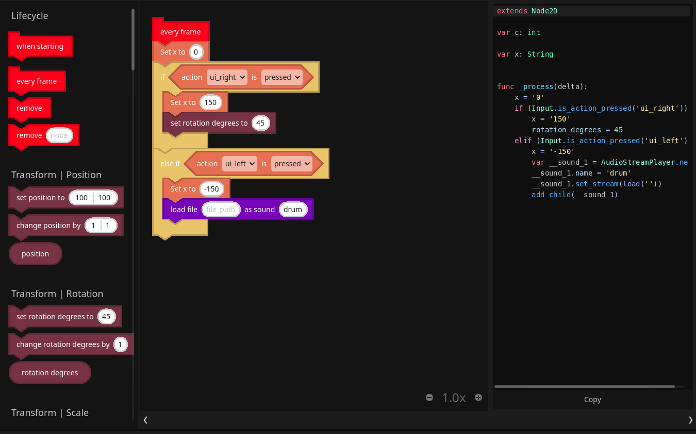
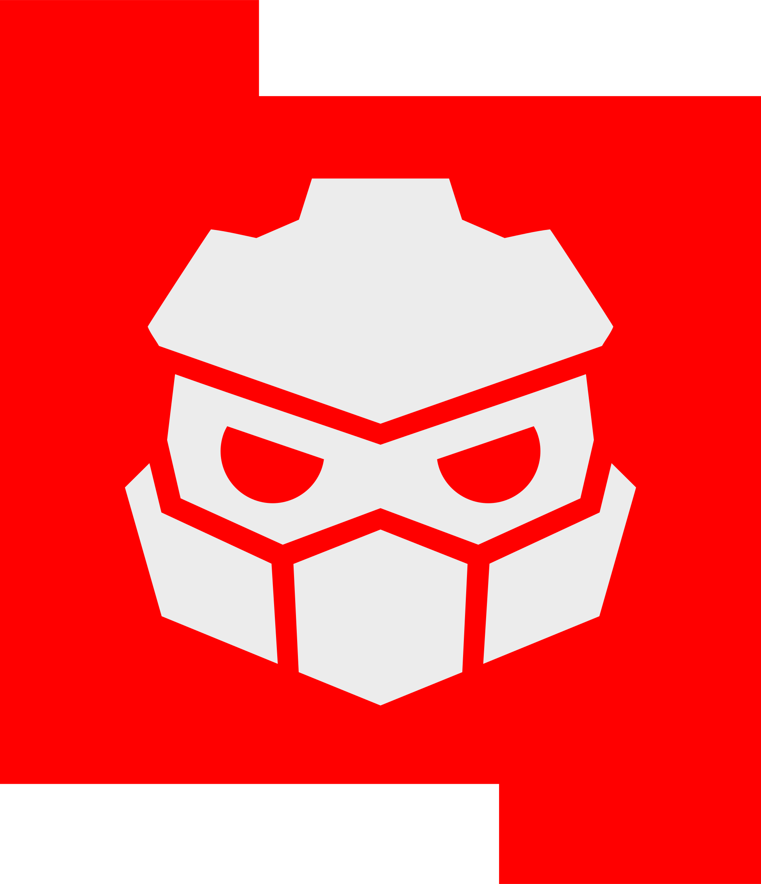

# Godot Block Coding Plugin

ReBlocks is a fork of the very good Block Coding plugin by [Endless OS Foundation](https://endlessos.org). While their mission is to provide a way to learn to program and eventually move to code, we want to provide a general use visual tool for making games, that will both enable users to make any kind of game they want without necessarily moving to code.

## Background

From the very beginning of creating Redot, we've wanted both a community developed and supported, "official" visual scripting plugin that we could provide learning content, documentation, and examples for. Not to mention games. While this project is far from that goal, We fully intend to continue to develop and expand its capabilities, in order to eventually reach the goal of it being a solid, general use, game development alternative to coding.

While there are other ways of visually programming a game, we feel that the block style is both an easy to learn, and closer to code-style where it does make it easier to pick up code if you wanted to. In that way, this tool will help people who want to learn to code but feel overwhelmed by code, to learn how to think logically and write in a more human way.

On the other hand, there are plenty of people who just like the idea of visual scripting, have used other tools that are similar and would just like to continue with that paradigm.  

## Current Status

This plugin is under heavy development, and as such should not be used for general game development. we welcome anyone to download and give us feedback to help further development, as well as any help in the programming department. Currently the plugin is being developed by @Andevrs and @Takun.

## Feedback & Discussion

Please join our [Discord](https://discord.gg/Z6WvTeN3kM) to provide feedback, share ideas, and ask questions. You can also join the general Redot [discord](https://discord.gg/redot)

